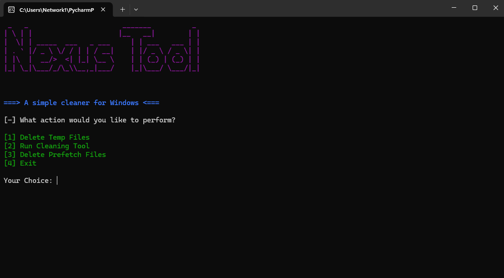

# 🛠️Nexus Tool

# 📜Description
Nexus Tool is a powerful utility designed to efficiently clean up unnecessary and temporary files on Windows systems. By removing redundant files such as temporary internet files, system caches, and old logs, Nexus helps free up valuable disk space and enhances your computer’s performance. With its intuitive and user-friendly interface, Nexus makes it easy to scan your system for clutter and perform cleanups, ensuring a more organized and optimized storage system.

# ✨Features
* Efficient Cleanup:
Removes temporary internet files, system caches, and old logs to free up disk space.

* User-Friendly Interface:
Easy-to-use design makes scanning and cleaning your system straightforward.

* Performance Boost:
Helps improve your computer’s performance by eliminating unnecessary clutter.

* Organized Storage:
Keeps your storage system organized by removing redundant files.

## 📝Usage
1. **Open Nexus Tool:**
   - Launch the application.

2. **Select Areas to Clean:**
   - In the main interface, choose from various cleanup options.

3. **Start the Cleanup Process:**
   - Enter the "Number" to begin removing unnecessary files.

4. **Review Results:**
   - Once the cleanup is complete, check the results to see how much space has been freed.

## 🐛Reporting Bugs

If you encounter any issues or bugs while using Nexus Tool, please report them on our [GitHub Issues page](https://github.com/ByteLogNet/Nexus-Tool/issues). We appreciate your feedback and will work to resolve any issues as quickly as possible.
